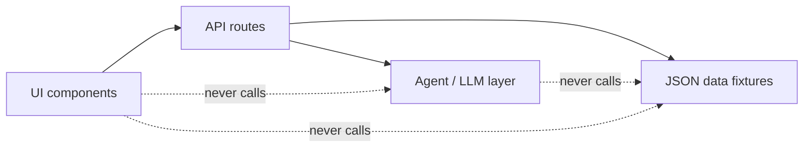

# Architecture Spine — AgileCopilot

## Design Paradigm

A single Next.js (App Router) project, layered top to bottom: **UI components** (dashboard views, one per pillar) → **API routes** (the only place that touches data or calls the LLM) → **agent/LLM layer** (Gemini API calls for narrative generation, ticket↔doc matching, delegation suggestions, draft text) → **data fixtures** (static JSON files standing in for Jira/Confluence/ops-inbox exports). UI components never call the LLM or read fixture files directly — they only call API routes. This keeps the POC swappable later: a fixture file becomes a live API call, and the LLM layer is the only place prompt logic lives.

## Invariants & Rules

### AD-1 — UI components never read data fixtures or call the LLM directly

- **Binds:** FR-1, FR-4, FR-12 (all data ingestion), FR-2, FR-5, FR-13, FR-14 (all LLM calls)
- **Prevents:** two UI components independently deciding how to parse a fixture or shape a prompt, diverging on error handling or on what "missing field" means.
- **Rule:** every fixture read and every LLM call happens inside an API route; UI components fetch from `/api/*` only.

### AD-2 — The LLM layer is a stateless function per capability, never a shared session

- **Binds:** FR-2 (narrative), FR-5 (matching confidence), FR-13 (delegation labels), FR-14 (draft text)
- **Prevents:** one capability's prompt or system context leaking into another's output.
- **Rule:** each LLM-backed capability is its own function taking typed input and returning typed output; no capability calls another capability's prompt-building code.

### AD-3 — Every write is local UI state; nothing else

- **Binds:** FR-3 (Copy report), FR-13 (Delegate control), FR-14 (Copy control)
- **Prevents:** a delegate/draft/copy action silently reaching a real system of record before the POC is meant to.
- **Rule:** this app performs zero outbound network side effects; every "action" (Copy, Delegate, Refresh) mutates UI state, copies to the clipboard, or re-reads a local fixture, never a third-party write API. (Historical note: an earlier build posted to a Teams webhook here; that integration was removed in favor of the clipboard-only Copy action.)



## Consistency Conventions

| Concern | Convention |
| --- | --- |
| Naming (entities, files, interfaces, events) | Ticket, Sprint, Doc, OpsItem — match the Glossary in the PRD exactly; API routes named after the capability (`/api/report`, `/api/doc-links`, `/api/process-health`, `/api/ops-inbox`, `/api/performance-import`). |
| Data & formats (ids, dates, error shapes, envelopes) | Dates ISO 8601 (`YYYY-MM-DD`) matching the sample fixtures; ticket/doc/ops-item ids are the fixture's own string ids, never regenerated; API errors are `{ error: string }` with a 4xx/5xx status, never a bare crash. |
| State & cross-cutting (mutation, errors, logging, config, auth) | No auth in the POC; all "assignment"/"delegation" state lives in client-side UI state (lost on refresh, acceptable for a POC); every failure (validation, LLM call) is logged server-side and surfaced as a non-blocking UI toast or inline error, never a thrown unhandled error. |

## Stack

| Name | Version |
| --- | --- |
| Node.js | 20.12+ |
| Next.js (App Router) | 14.x |
| Tailwind CSS | 3.x |
| Gemini API | `gemini-1.5-flash`, called server-side only, optional (deterministic template fallback when `GEMINI_API_KEY` is unset) |
| better-sqlite3 (optional upgrade path) | not used in POC — static JSON fixtures instead. *Product decision (2026-09-14): a real database is planned for the next phase.* |

## Structural Seed

```text
agile-assistant/
  app/
    page.tsx                       # Public marketing landing page (not signed-in)
    (app)/                         # Signed-in route group, shared Sidebar shell
      overview/page.tsx            # Home screen — surfaces Ops Hub highlights first
      ops-hub/page.tsx             # Ops Hub (FR-12..15)
      report/page.tsx              # Auto Report view (FR-9)
      process-health/page.tsx      # Process Health view (FR-10)
      doc-linker/page.tsx          # Doc Linker view (FR-11)
      performance-import/page.tsx  # Performance Import view (FR-16..19)
    api/
      sprint/route.ts              # FR-1 ingest + refresh
      docs/route.ts                # FR-4 ingest
      ops-inbox/route.ts           # FR-12 ingest
      report/route.ts              # FR-2 generate narrative
      doc-links/route.ts           # FR-5, FR-6 match + flag
      process-health/route.ts      # FR-7, FR-8 rules + table
      delegate/route.ts            # FR-13 delegation suggestions
      draft/route.ts               # FR-14 draft text
      performance-import/route.ts  # FR-16..19 parse + compute
  components/
    Sidebar.tsx                    # Nav shell for the (app) route group
  lib/
    llm/                      # AD-2: one function per LLM-backed capability
      narrative.ts
      match-docs.ts
      suggest-delegate.ts
      draft-text.ts
    data/                     # fixture loaders, one per fixture file
      jira.ts
      confluence.ts
      ops-inbox.ts
      performance-import.ts  # tool-agnostic export parser (FR-16)
    performance-metrics.ts   # FR-17..19 templates
  data/
    jira-sprint-sample.json
    confluence-pages-sample.json
    ops-inbox-sample.json
    performance-import-sample.csv
```

## Capability → Architecture Map

| Capability / Area | Lives in | Governed by |
| --- | --- | --- |
| FR-1 Ingest sprint data | `lib/data/jira.ts`, `app/api/sprint/route.ts` | AD-1 |
| FR-2 Generate narrative report | `lib/llm/narrative.ts`, `app/api/report/route.ts` | AD-1, AD-2 |
| FR-3 Copy report for sharing | `app/(app)/report/page.tsx` (client-side clipboard only) | AD-3 |
| FR-4 Ingest Confluence docs | `lib/data/confluence.ts`, `app/api/docs/route.ts` | AD-1 |
| FR-5/FR-6 Match & flag docs | `lib/llm/match-docs.ts`, `app/api/doc-links/route.ts` | AD-1, AD-2 |
| FR-7/FR-8 Process Health | `app/api/process-health/route.ts` | AD-1 |
| FR-9/FR-10/FR-11 Dashboard views | `app/(app)/report`, `app/(app)/process-health`, `app/(app)/doc-linker` | AD-1 |
| FR-12 Ops inbox | `lib/data/ops-inbox.ts`, `app/api/ops-inbox/route.ts` | AD-1 |
| FR-13 Delegation suggestions | `lib/llm/suggest-delegate.ts`, `app/api/delegate/route.ts` | AD-1, AD-2, AD-3 |
| FR-14 Draft text | `lib/llm/draft-text.ts`, `app/api/draft/route.ts` | AD-1, AD-2, AD-3 |
| FR-15 Pending approvals | `app/(app)/ops-hub/page.tsx`, reuses FR-12 data + FR-14 draft | AD-1 |
| FR-16 Ingest any-tool export | `lib/data/performance-import.ts`, `app/api/performance-import/route.ts` | AD-1 |
| FR-17/FR-18/FR-19 Performance templates | `lib/performance-metrics.ts`, `app/api/performance-import/route.ts` | AD-1 |

## Deferred

- Real Jira/Confluence live API connectors — deferred to post-POC; the fixture loaders in `lib/data/` are the seam where a live API client would replace a `fs.readFile`.
- **Persistent storage (SQLite via `better-sqlite3`) — deferred; only needed once "Delegate" or "Refresh" must survive a page reload. Product decision (2026-09-14): planned for the next phase — tracked separately, intentionally not part of this build.**
- Auth/SSO — deferred; no session concept exists yet at this altitude.
- Multi-project/multi-department support — deferred; the data shape assumes exactly one sprint and one ops inbox at a time.
- A Teams (or any messaging platform) integration — removed (2026-09-14) in favor of a clipboard-only "Copy report" action; may be revisited post-POC if a specific channel is required.
